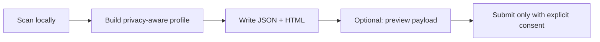
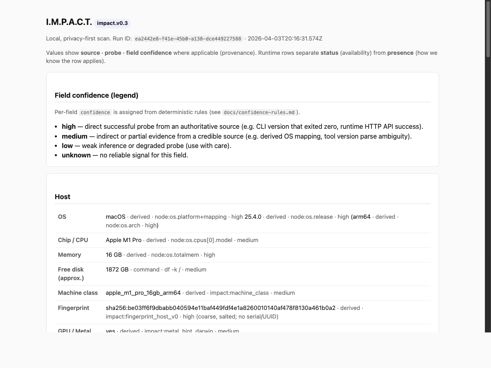

# IMPACT

**IMPACT is a privacy-first local scanner** that inventories the AI-relevant environment of a machine — system signals, runtimes, curated tools, and models discovered through supported local APIs — then writes a **structured profile** and **HTML report** on disk. **Optional** anonymous submission exists only after you configure an endpoint and **explicitly** consent; **nothing is uploaded by default.**

**I.M.P.A.C.T.** = **(I)ndustrial (M)ulti-(P)latform (A)gent (C)onnector (T)est**: a long-horizon programme toward sovereign evaluation of **system + tool + LLM** stacks. **Today you get the discovery scanner and reports** — not capability benchmarks (those are programme roadmap).

**Next step:** use the row below or jump straight to [Quick start](#quick-start-recommended).

| Quick start | Privacy & trust | Programme board | Current state |
| ----------- | --------------- | --------------- | ------------- |
| [Jump](#quick-start-recommended) | [Jump](#privacy-and-trust) | [Open board](https://github.com/users/moldovancsaba/projects/2/views/3) | [Read snapshot](docs/current-state.md) |

---

## Why IMPACT exists

Many people run or evaluate **local AI** and wonder what their machine can actually support. Most lack a single, honest picture of what is installed, reachable, and worth trying. IMPACT starts with an **inventory you can inspect**: conservative detection, provenance on fields, and clear confidence — not a hype score.

Later programme phases (see [product spec](docs/product.md) and [phase ladder](https://github.com/moldovancsaba/impact/issues/16)) aim at **readiness hints**, **atomic tests**, and **capability benchmarks**. Those are **not** shipped as product truth in v0.x.

---

## What you get

1. **System inventory** — OS, architecture, coarse hardware class, memory/disk hints where available, optional GPU/acceleration hints (conservative).
2. **Runtime, tool, and model discovery** — supported runtimes (e.g. Ollama with local API), **allowlisted** CLI tools on `PATH`, models when the runtime exposes them.
3. **Anonymous shareable profile** — versioned JSON suitable for review or optional submission, plus a readable HTML report.

**Artifacts** (default scan, output directory you choose):

| File | Purpose |
| ---- | ------- |
| `impact-profile.json` | Machine-readable **profile** (`impact.v0.3` schema) |
| `impact-report.html` | Human-readable **report** in the browser |
| `impact-submission-preview.json` | Only if you opt into submission — **exact** JSON that would be sent |
| `impact-submission-receipt.json` | Only after a submission attempt — outcome metadata for your records |

---

## How it works



1. **Scan locally** — probes use local OS and, where applicable, localhost services (e.g. Ollama on `127.0.0.1`). Default scan needs **no network upload**.
2. **Build profile** — structured data with field provenance, **`status`** (operational) vs **`presence`** (what we know), and confidence labels.
3. **Generate reports** — same facts as HTML and JSON.
4. **Preview** — if you enable submission, the CLI can write the exact outbound payload for inspection.
5. **Submit** — only after configuration, prompts, and confirmation; see [privacy for users](docs/privacy-for-users.md) and [submission contract](docs/submission-contract.md).

**Sample HTML report** (captured from a real local scan; yours will match your environment):



**Redacted profile excerpt** (structure only; values anonymised for documentation):

```json
{
  "schema_version": "impact.v0.3",
  "run_id": "00000000-0000-4000-8000-000000000001",
  "host": {
    "machine_class": { "value": "example_laptop_16gb_arm64", "confidence": "medium" },
    "fingerprint_hash": { "value": "sha256:REDACTED_…", "confidence": "high" },
    "os_name": { "value": "macOS", "confidence": "high" },
    "architecture": { "value": "arm64", "confidence": "high" }
  },
  "runtimes": [{ "id": "ollama", "status": "installed_reachable", "presence": "detected" }]
}
```

Full validated example: [fixtures/baseline-profile.sample.json](fixtures/baseline-profile.sample.json). Redacted excerpt file: [docs/assets/impact-profile-redacted.excerpt.json](docs/assets/impact-profile-redacted.excerpt.json).

---

## Quick start (recommended)

**Canonical path (Path B):** **install from source** — clone → `npm ci` → `npm run build` → `npm install -g ./apps/cli` → `impact scan`. **Verified** on macOS (fresh clone, Path B) — see [docs/smoke-test-macos.md](docs/smoke-test-macos.md) verification log (2026-04-03). There is still **no** published `npm install -g @impact/cli` from the **npm registry**; that remains future work. Packaging track [#27](https://github.com/moldovancsaba/impact/issues/27) is **closed** for Path B; the board should show **Done**.

**Platform:** **macOS** is the supported primary path. **Linux** is partial; **Windows** is experimental — [support matrix](docs/support-matrix.md).

**The three steps (today):**

1. **Install** the CLI from a clone (commands below).  
2. **Run** `impact scan --no-submit -o ./reports`.  
3. **Inspect** `reports/impact-profile.json` and `reports/impact-report.html`.

```bash
git clone https://github.com/moldovancsaba/impact.git
cd impact
npm ci
npm run build
npm install -g ./apps/cli
mkdir -p ./reports
impact scan --no-submit -o ./reports
open ./reports/impact-report.html   # or open the file from your file manager
```

Full detail and secondary (dev-only) path: [docs/install-macos.md](docs/install-macos.md). **Release QA:** [docs/smoke-test-macos.md](docs/smoke-test-macos.md).

**Without global install** (repo developers): from repo root after `npm ci` && `npm run build`: `npm run impact -- scan --no-submit -o ./reports`.

---

## Privacy and trust

- **Local-first:** default scan does not send data off your machine.
- **No raw serials / hardware UUIDs**, usernames, hostnames as identifiers, arbitrary file contents, or env secrets — see [Privacy for users](docs/privacy-for-users.md) (plain language) and [Privacy policy](docs/privacy-policy.md) (formal).
- **Submission is optional** and requires a configured endpoint plus explicit confirmation; you can inspect **`impact-submission-preview.json`** before anything is sent.
- **Fingerprinting** used for optional anonymous aggregation is **salted** and stored locally (`~/.impact/salt`); it is not a vendor serial.

---

## Today vs later

This table is **conservative on purpose**: it sets expectations and **does not** track marketing language. It changes when **scope** changes, not for polish.

| Today (v0.x) | Later (programme) |
| ------------ | ------------------- |
| Discovery **scanner** + HTML/JSON **profile** | Atomic reliability tests, **capability benchmarks** |
| Coarse **readiness hints** (not benchmark scores) | Deeper evaluation ladder — [issue #16](https://github.com/moldovancsaba/impact/issues/16) |
| **Privacy-first**, optional anonymous **submission** | Richer programme surfaces as scoped in [product.md](docs/product.md) |

Discovery comes first so later benchmarks attach to **observable truth** about what can run where — not guesses.

---

## Support matrix (summary)

| OS | Level |
| -- | ----- |
| **macOS** | **Supported** — primary target for host and runtime probes. |
| **Linux** | **Partial** — best-effort; expect more unknowns than on macOS. |
| **Windows** | **Experimental** — do not assume parity until documented. |

Full detail: [docs/support-matrix.md](docs/support-matrix.md).

---

## Documentation

Curated index: **[docs/README.md](docs/README.md)**  

| Topic | Document |
| ----- | -------- |
| Install & run | [docs/install-macos.md](docs/install-macos.md) |
| Privacy (plain language) | [docs/privacy-for-users.md](docs/privacy-for-users.md) |
| Privacy (policy) | [docs/privacy-policy.md](docs/privacy-policy.md) |
| Support by OS | [docs/support-matrix.md](docs/support-matrix.md) |
| What ships now | [docs/current-state.md](docs/current-state.md) |
| Product / programme | [docs/product.md](docs/product.md) |
| Board & contributor ops | [docs/project-management.md](docs/project-management.md) |
| Submission HTTP contract | [docs/submission-contract.md](docs/submission-contract.md) |
| Architecture | [docs/architecture.md](docs/architecture.md) |
| Release QA | [docs/release-checklist.md](docs/release-checklist.md) · [docs/smoke-test-macos.md](docs/smoke-test-macos.md) |

**Doctrine & planning (SSOT):** [GitHub Issues](https://github.com/moldovancsaba/impact/issues) · [Programme board — not Done](https://github.com/users/moldovancsaba/projects/2/views/3) · [full board](https://github.com/users/moldovancsaba/projects/2/views/1)

---

## Contributing

Bug reports, ideas, and code: [CONTRIBUTING.md](CONTRIBUTING.md). MIT License — see [LICENSE](LICENSE).

---

## Programme note

IMPACT is **open source**. The **scanner** and **reports** are the current product slice; **benchmarks** in the programme sense are **roadmap**, not current claims. If anything here disagrees with the code, **the repo implementation wins** — file an issue.
